# GridFlock

A gridfinity-compatible baseplate generator for small printer beds. Cuts the base plate into pieces that fit the printer bed and can be linked together using puzzle-style locking connectors. 

  <a href="https://gridflock.yawk.at/?utm_source=github&utm_campaign=readme_gridflock_banner">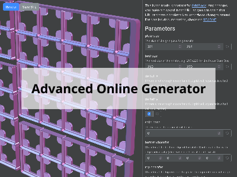</a>
  <a href="https://gridfinity.perplexinglabs.com/pr/gridflock/0/0">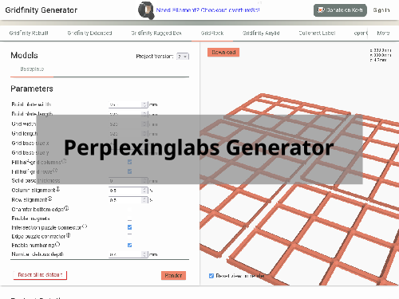</a>

An online generator for the latest version version of GridFlock is available [here](https://gridflock.yawk.at/?utm_source=github&utm_campaign=readme_gridflock). You can also use [the perplexinglabs generator](https://gridfinity.perplexinglabs.com/pr/gridflock/0/0) which is a bit more stable. Please also support the model page [on Printables](https://www.printables.com/model/1579487-gridflock-gridfinity-baseplate-generator).

Similar projects include GridPlates (DMCA'd) and GRIPS, but GridFlock is an independent, open-source, clean-room implementation. My goal is truly open community development. If you are missing a feature that is available in GridPlates or GRIPS, please create a GitHub ticket.

GridFlock uses [Gridfinity Rebuilt](https://github.com/kennetek/gridfinity-rebuilt-openscad) (under MIT license) for the baseplate cutter.

For inserting magnets, check out [the jig](#jig).

<!-- openscad -o docs/images/whole.png --camera=0,-10,0,40,0,10,900 -D plate_size='[420, 420]' -->
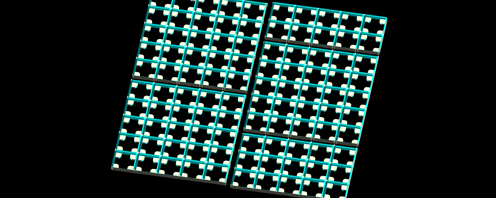

<!-- openscad -o docs/images/closeup.png --camera=0,30,0,40,0,25,300 -D plate_size='[420, 420]' -->
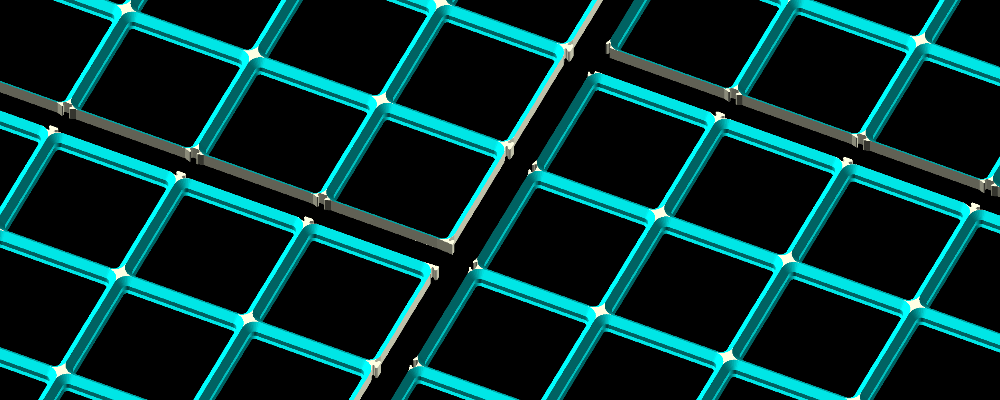

- [GridFlock](#gridflock)
  - [Connectors](#connectors)
    - [Intersection Puzzle](#intersection-puzzle)
      - [Connector Fit](#connector-fit)
    - [Edge Puzzle](#edge-puzzle)
      - [Connector Height](#connector-height)
      - [Connector Count](#connector-count)
  - [Magnets](#magnets)
    - [No Magnets](#no-magnets)
    - [Press-Fit magnets](#press-fit-magnets)
      - [Jig](#jig)
    - [Glued magnets](#glued-magnets)
    - [Rounded corner frame](#rounded-corner-frame)
    - [Solid frame](#solid-frame)
  - [Click Latch](#click-latch)
    - [Length](#length)
    - [Distance](#distance)
    - [Latch Strength](#latch-strength)
    - [Latch Wall Strength](#latch-wall-strength)
    - [Height](#height)
    - [Steepness](#steepness)
  - [Half-sized cells](#half-sized-cells)
  - [Corner radius](#corner-radius)
  - [Alignment](#alignment)
  - [Custom cell size](#custom-cell-size)
  - [Solid base](#solid-base)
  - [Bottom Chamfer](#bottom-chamfer)
  - [Top Chamfer](#top-chamfer)
  - [Numbering](#numbering)
    - [Squeezed number](#squeezed-number)
  - [Plate Wall](#plate-wall)
    - [Top plate wall](#top-plate-wall)
    - [Bottom plate wall](#bottom-plate-wall)
  - [Vertical Screws](#vertical-screws)
    - [Screw dimensions](#screw-dimensions)
    - [Screw locations](#screw-locations)
      - [Plate corners](#plate-corners)
      - [Plate edges](#plate-edges)
      - [Segment corners](#segment-corners)
      - [Segment edges](#segment-edges)
      - [Other intersections](#other-intersections)
      - [Combined](#combined)
  - [Thumb Screw](#thumb-screw)
  - [Segmentation](#segmentation)
    - [Horizontal](#horizontal)
    - [Vertical](#vertical)
  - [Edge Adjustment](#edge-adjustment)
    - [Shifting the grid](#shifting-the-grid)
    - [Adding empty space](#adding-empty-space)
    - [Squeezing in extra cells](#squeezing-in-extra-cells)
  - [Cell override](#cell-override)
    - [Normal cell](#normal-cell)
    - [Solid](#solid)
    - [Empty](#empty)
    - [Irregular Shapes](#irregular-shapes)
  - [Building from source](#building-from-source)
  - [Why the name?](#why-the-name)

## Connectors

When the plate size exceeds your printer's bed size, GridFlock will split the plate into multiple pieces called 'segments'. To connect these segments, multiple connector designs are available.

### Intersection Puzzle

[Interactive example](https://gridflock.yawk.at/?utm_source=github&utm_campaign=readme_gridflock_example#eyJiZWRfc2l6ZSI6WzUwLDUwXSwicGxhdGVfc2l6ZSI6Wzg0LDg0XX0%3D)

This mode adds small puzzle-style connectors at cell intersections. This is similar to GridPlates and GRIPS, and relatively easy to print. However, in my experience, these connectors can sometimes lead to gaps between the segments. The shape of these connectors is fixed in [puzzle.svg](https://github.com/yawkat/GridFlock/blob/main/puzzle.svg) and cannot be customized without editing the SVG.

<!-- openscad -o docs/images/intersection-puzzle.png --camera=0,30,0,40,0,25,300 -D plate_size='[420, 420]' -->

#### Connector Fit

The intersection puzzle connector is intentionally tight to produce a secure fit. It may be necessary to use a mallet or hammer to connect plates.

If the puzzle connector is too tight for your print settings, you can use the `intersection_puzzle_fit` parameter to produce a looser fit. A value of 0 produces the loosest fit, while 1 is the tightest. Try multiple settings and see which works best for you. Tight fit example (`intersection_puzzle_fit=1`):

<!-- openscad -o docs/images/intersection-puzzle-tight.png --camera=0,0,0,40,0,25,70 -D plate_size='[84, 84]' -D bed_size='[50, 1000]' -D magnets=false -->
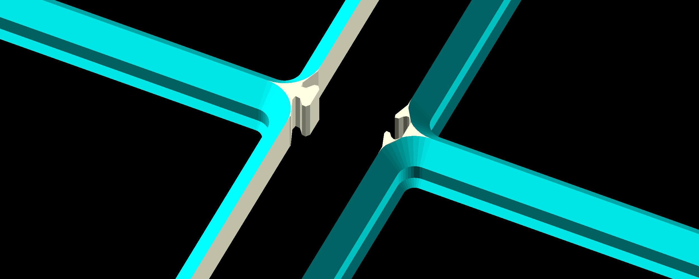

Loose fit example (`intersection_puzzle_fit=0`):

<!-- openscad -o docs/images/intersection-puzzle-loose.png --camera=0,0,0,40,0,25,70 -D plate_size='[84, 84]' -D bed_size='[50, 1000]' -D magnets=false -D intersection_puzzle_fit=0 -->

You can find small grids with different fit values to calibrate [on printables](https://www.printables.com/model/1579487-gridflock-gridfinity-baseplate-generator/files).

### Edge Puzzle

[Interactive example](https://gridflock.yawk.at/?utm_source=github&utm_campaign=readme_gridflock_example#eyJiZWRfc2l6ZSI6WzUwLDUwXSwicGxhdGVfc2l6ZSI6Wzg0LDg0XSwiY29ubmVjdG9yX2ludGVyc2VjdGlvbl9wdXp6bGUiOmZhbHNlLCJjb25uZWN0b3JfZWRnZV9wdXp6bGUiOnRydWV9)

The edge puzzle mode uses larger connectors placed at the edges of cells, instead of intersections. This leads to a more accurate fit, but is a bit harder to print, and uses more filament.

This connector is a good alternative to the intersection puzzle if the plate has enough vertical height. Try both and see what works best for you. You can also technically enable both at the same time, though I don't know why you would.

* At a segment corner where female connectors are placed on both adjacent sides, the corner could be "cut off" from the rest of the segment. To avoid this, the connector does not use the full height. When *not* using magnets, this can make the connector quite flimsy.
* To avoid interference with the bin in the neighbouring cell, the male connector has a cutout identical to the bin in that cell. Again, if there is not enough vertical height (no magnets), this can make the male connector flimsy.
* To make the female connectors more sturdy and easier to print, an extra "bar" is added at the magnet level, on those edges where a female connector is placed (only if magnets are enabled). You can see it in the screenshot. With this bar, it may be viable to make the connector full-height and avoid the overhang.
* Unlike the intersection mode, the edge puzzle connectors are highly customizable for your circumstances.

<!-- openscad -o docs/images/edge-puzzle.png --camera=0,30,0,40,0,25,300 -D plate_size='[420, 420]' -D connector_intersection_puzzle=false -D connector_edge_puzzle=true -D magnets=true -->
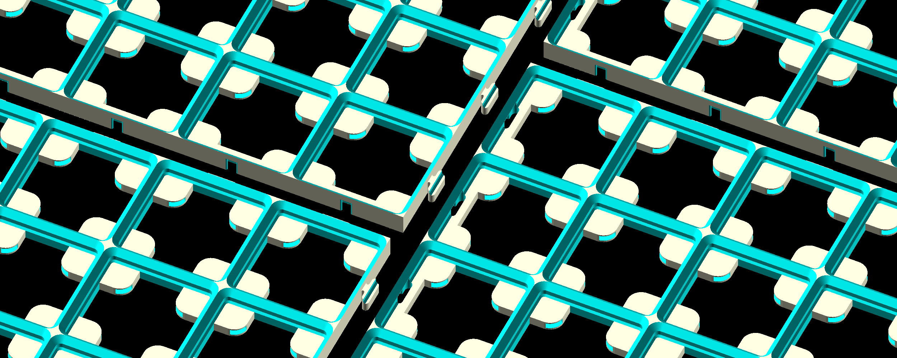

#### Connector Height

The edge puzzle connector height can be configured using the `edge_puzzle_height_female` property. The male connector is smaller than this option by `edge_puzzle_height_male_delta`.

With default settings, the male side of the connector can only be pushed into the female side from below. If you increase the `edge_puzzle_height_female` to e.g. 10mm, it will use the full height, and the connector can be pushed from both sides.

<!-- openscad -o docs/images/edge-puzzle-full-height.png --camera=0,0,0,40,0,10,200 -D plate_size='[84, 63]' -D connector_intersection_puzzle=false -D connector_edge_puzzle=true -D 'bed_size=[50, 80]' -D magnets=true -D edge_puzzle_height_female=10 -->
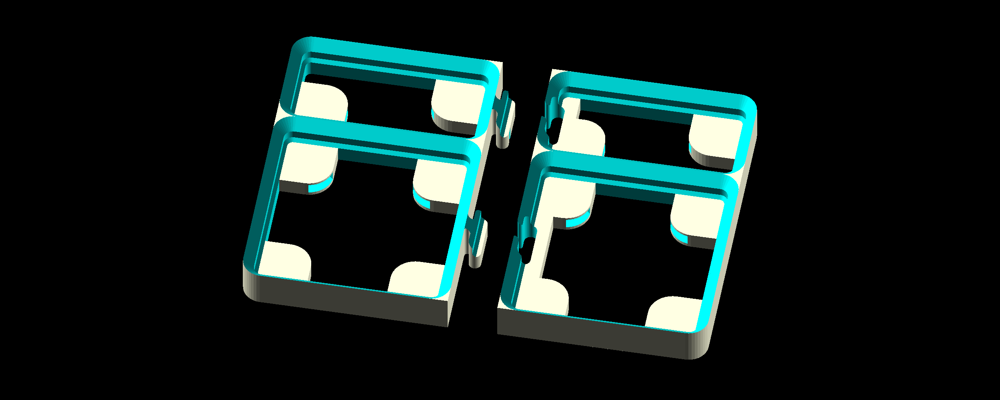

The problem with the full-height connector is that it can lead to unconnected pieces if there is no magnet layer for support. You can see in the below example that the bottom left corner of the top right segment has no connection to the rest of the segment.

<!-- openscad -o docs/images/edge-puzzle-unconnected.png --camera=0,0,0,40,0,10,200 -D plate_size='[84, 84]' -D connector_intersection_puzzle=false -D connector_edge_puzzle=true -D 'bed_size=[50, 50]' -D magnets=false -D edge_puzzle_height_female=10 -->

#### Connector Count

The connector count can be configured using the `edge_puzzle_count` property.

<!-- openscad -o docs/images/edge-puzzle-multi.png --camera=0,0,0,40,0,10,200 -D plate_size='[84, 63]' -D connector_intersection_puzzle=false -D connector_edge_puzzle=true -D 'bed_size=[50, 80]' -D magnets=true -D edge_puzzle_count=3 -->
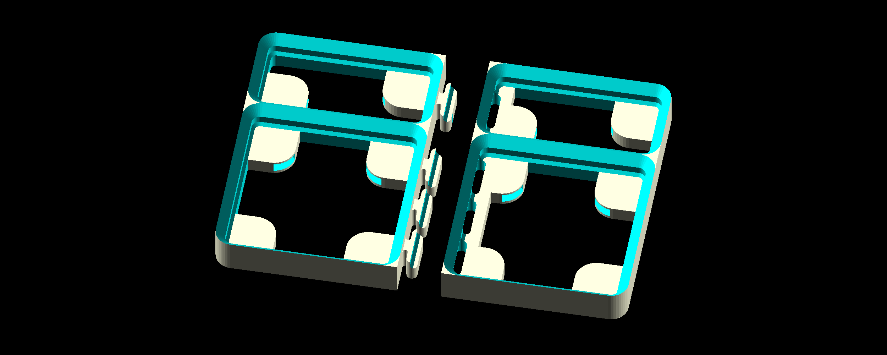

## Magnets

GridFlock supports the standard Gridfinity magnet layout. Note that magnets require additional vertical room.

Magnets are assumed to be round. The exact size can be configured with the `magnet_diameter` and `magnet_height` options.

### No Magnets

It is possible to disable magnets altogether to save filament and vertical space.

<!-- openscad -o docs/images/magnets-none.png --camera=0,0,0,40,0,10,200 -D plate_size='[105, 63]' -D magnets=false -->

### Press-Fit magnets

Press-fit magnets require no glue. The magnets are simply pressed into the pockets from the side. A jig for easily inserting magnets is available [on printables](https://www.printables.com/model/1579487-gridflock-gridfinity-baseplate-generator/files) (thanks @nelsonjchen!).

<!-- openscad -o docs/images/magnets-press-fit.png --camera=0,0,0,40,0,10,200 -D plate_size='[105, 63]' -D magnets=true -->
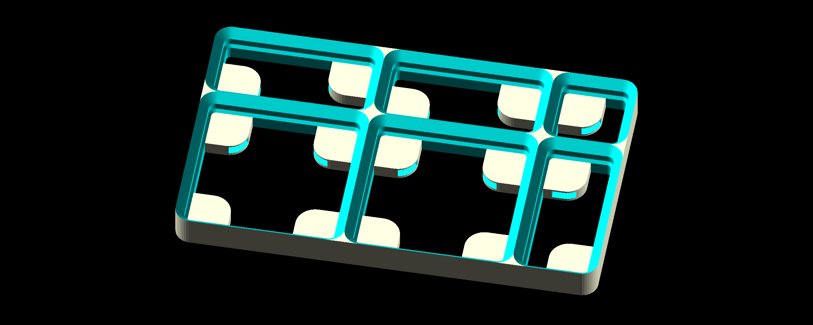

On the bottom side of the plate there is a slot so you can push out any inserted magnet with a screwdriver.

<!-- openscad -o docs/images/magnets-press-fit-below.png --camera=0,0,0,140,0,10,200 -D plate_size='[105, 63]' -D magnets=true -->
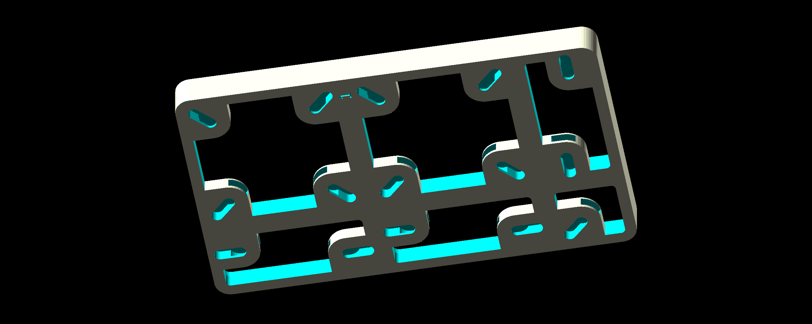

The layers above and below the magnet can be configured using the `magnet_top` and `magnet_bottom` options. 

Because the distance to the bin magnets is larger, press-fit magnets make for a weaker connection than glue-in magnets.

#### Jig

GridFlock includes a magnet insertion jig that makes pressing in magnets easy and fast (thanks @nelsonjchen!). You can download the jig [on printables](https://www.printables.com/model/1579487-gridflock-gridfinity-baseplate-generator/files).

The jig prints in two pieces, a main frame and a pusher. The pusher needs to be printed with supports, and should have a high infill percentage.

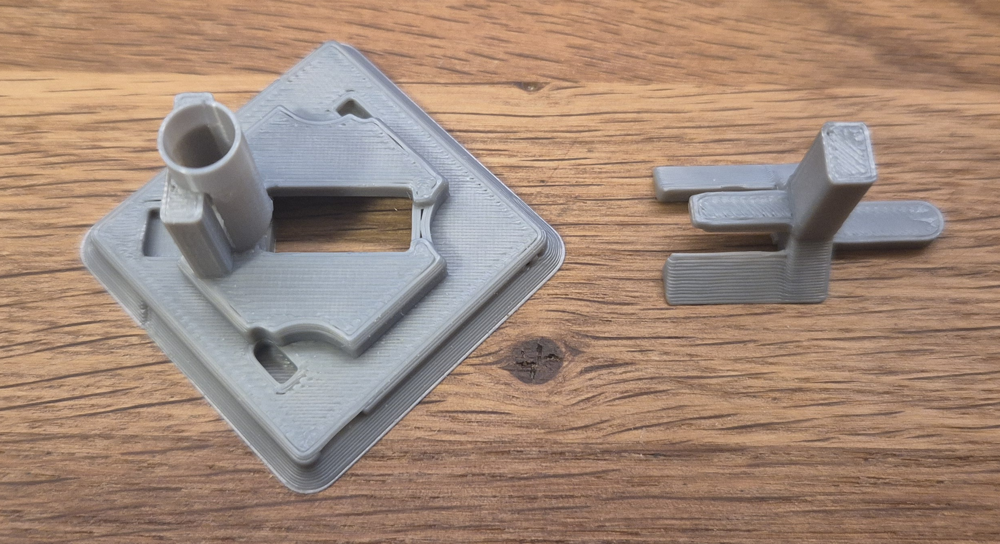

First, insert the reference magnet. The reference magnet will make sure that any magnets you put into the plate will have the right orientation, and it helps with pulling the magnets into place. Make sure it has the right orientation – see the below instructions on how the jig is used to figure it out. Place the reference magnet in the circled slot:

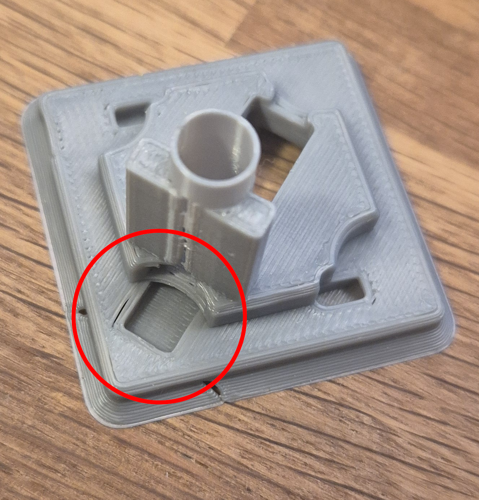

Next, push the reference magnet into the jig until it is fully seated. Here you can see it halfway:

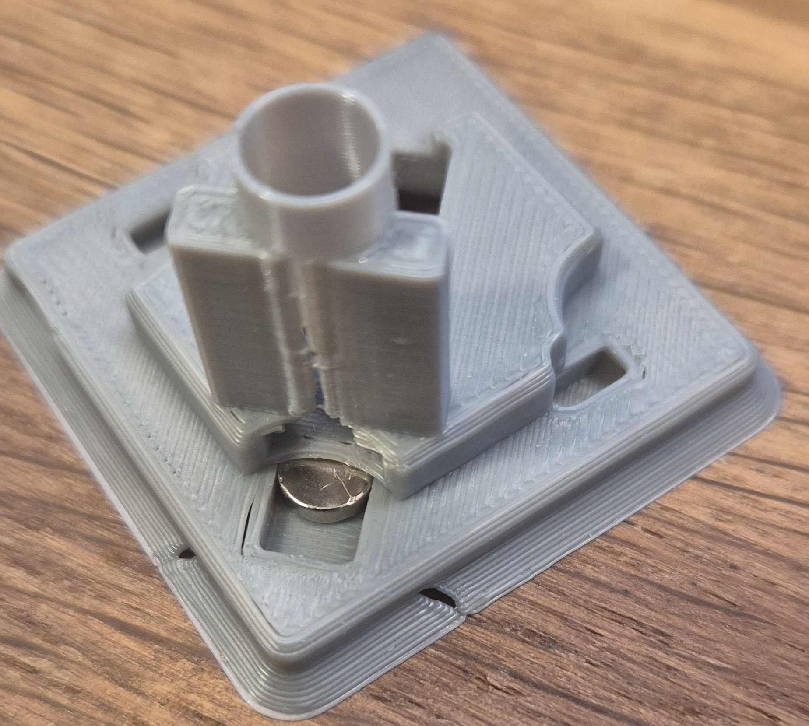

Now, place the jig on top of the pusher to finish assembly:

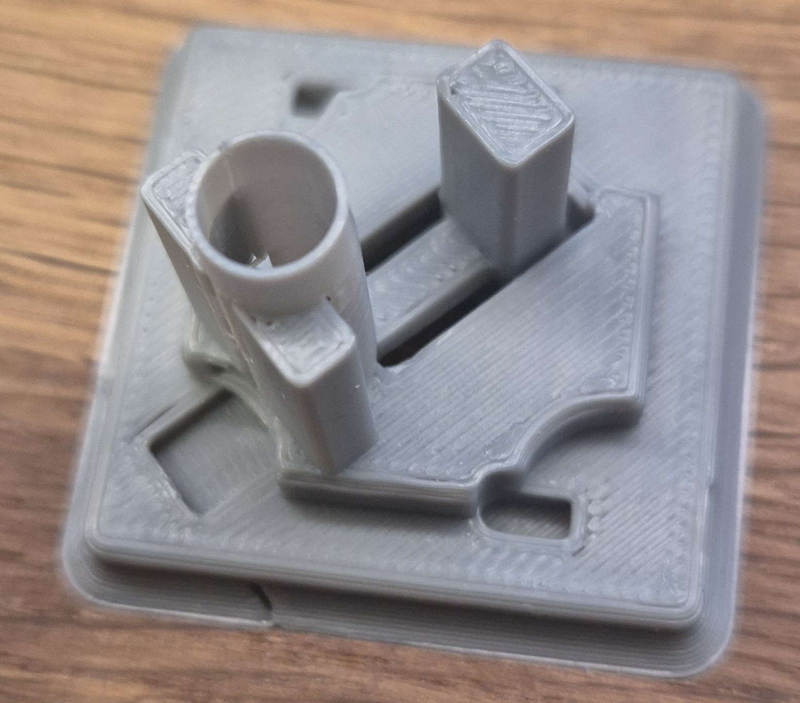

Now that the jig is assembled, you can start using it to populate your baseplate. Load a stack of magnets into the jig, and then place the baseplate upside down on the jig:

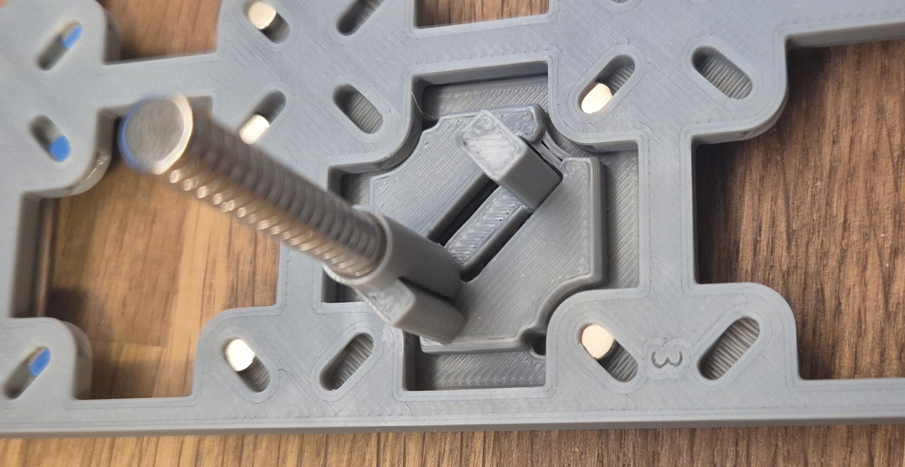

Now you can use the pusher to insert the magnet into the baseplate:

Pull the pusher back into its original position to release the baseplate. You can now turn the jig by 90° to insert the next magnet, and then move the baseplate to fill the next square with magnets.

### Glued magnets

Magnets can also be glued in from the top:

<!-- openscad -o docs/images/magnets-glue-in.png --camera=0,0,0,40,0,10,200 -D plate_size='[105, 63]' -D magnets=true -D magnet_style=0 -->
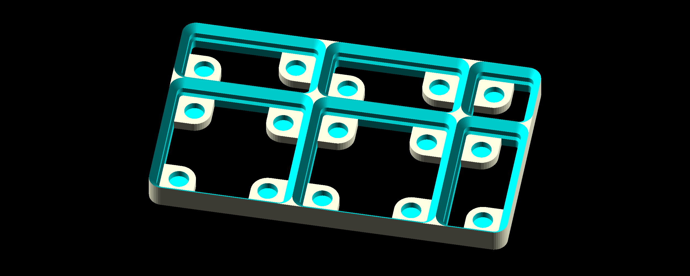

The `magnet_bottom` option is identical to the press-fit version, but the `magnet_top` option is ignored.

Or they can be glued from the bottom:

<!-- openscad -o docs/images/magnets-glue-in-bottom.png --camera=0,0,0,140,0,10,200 -D plate_size='[105, 63]' -D magnets=true -D magnet_style=2 -->
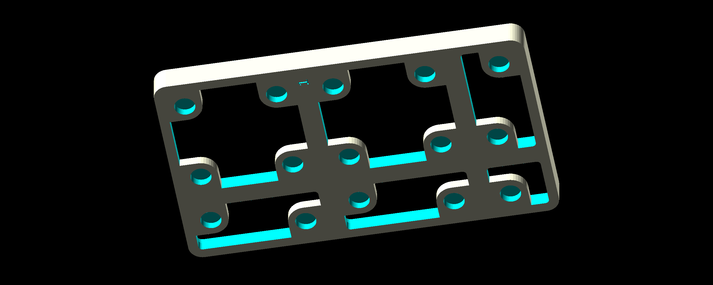

By tuning the magnet size, this last magnet style can also be used to press-fit magnets from the bottom, similar to Gridfinity Refined.

### Rounded corner frame

By default, the vertical space for the magnet is not fully filled in to save filament. This is called the "rounded corner" frame style.

### Solid frame

Using the `magnet_frame_style` option, you can change the magnet layer to be fully filled in.

> [!WARNING]
> The solid frame style cannot be combined with the press-fit magnet style because there is no way to push the magnets in.

<!-- openscad -o docs/images/magnets-solid.png --camera=0,0,0,40,0,10,200 -D plate_size='[105, 63]' -D magnets=true -D magnet_style=0 -D magnet_frame_style=0 -->
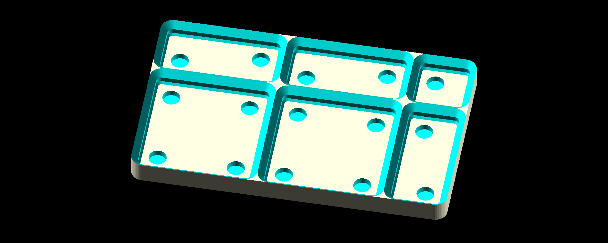

## Click Latch

If you do not wish to use magnets, but still want a more secure fit for your bins, a click latch is an option. A click latch grips the bottom of the bin.

> [!WARNING]
> When a bin is placed on the baseplate, the click latch is under constant mechanical stress. This causes the plastic to deform over time ("creep"), reducing the grip strength. _PLA is very susceptible to this._ PETG is more resistant, but long-term tests are still scarce, so _consider this feature experimental_.

<!-- openscad -o docs/images/click1.png --camera=0,0,0,40,0,10,200 -D plate_size='[105, 63]' -D click1=true -->
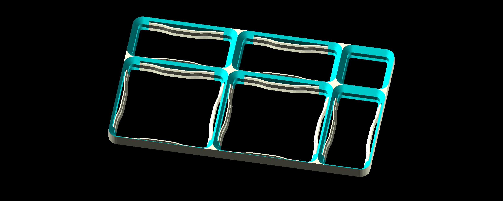

There are various parameters you can use to tune the click latch mechanism.

### Length

The latch is composed of two arcs at each end, and an optional middle straight section. The total length of the latch is configured using the `click1_outer_length` property:

<!-- openscad -o docs/images/click1-outer-length-20.png --camera=0,0,0,40,0,10,100 -D plate_size='[42, 42]' -D click1=true -D click1_outer_length=20 -->
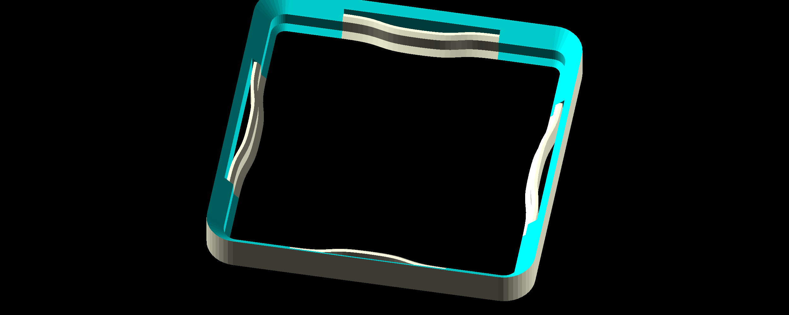

The length of the straight section is configured using `click1_inner_length`, which is 0 by default (no straight section). Here is an example with a 20mm straight section:

<!-- openscad -o docs/images/click1-inner-length-20.png --camera=0,0,0,40,0,10,100 -D plate_size='[42, 42]' -D click1=true -D click1_inner_length=20 -->
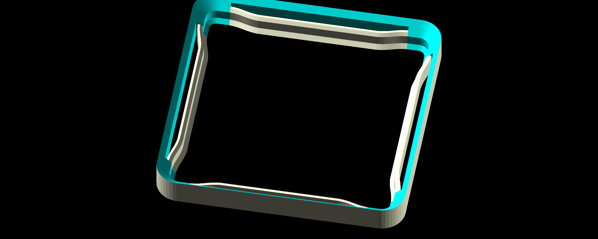

### Distance

The `click1_distance` property changes the distance that the latch protudes into the bin area. A larger distance can increase grip strength, but makes the bin more difficult to place into the baseplate. Zero distance:

<!-- openscad -o docs/images/click1-distance-0.png --camera=0,0,0,40,0,10,100 -D plate_size='[42, 42]' -D click1=true -D click1_distance=0 -->
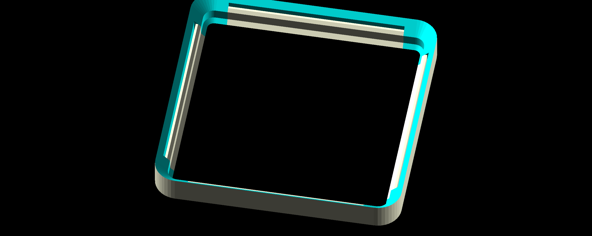

5mm distance (don't do this):

<!-- openscad -o docs/images/click1-distance-5.png --camera=0,0,0,40,0,10,100 -D plate_size='[42, 42]' -D click1=true -D click1_distance=5 -->
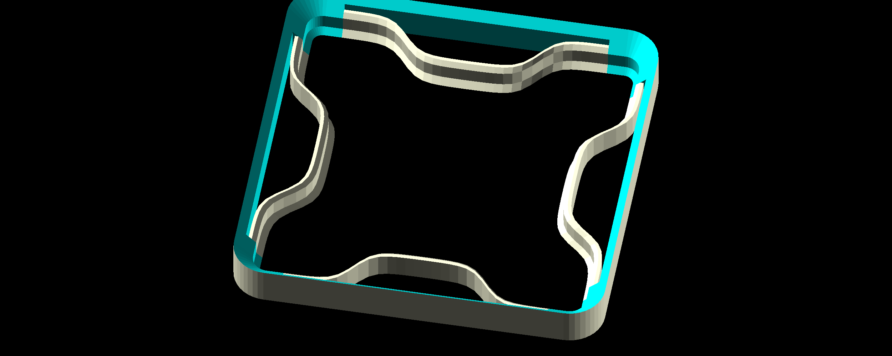

### Latch Strength

The `click1_strength` property controls the thickness of the latch itself. This is measured from the very bottom of the latch which, if you look at the gridfinity specification, has a chamfer of 0.7mm, so the strength needs to be higher than this to get any reasonable latch height. Here's an example with `click1_strength=2.5` (and `click1_wall_strength=0`, or else there would not be enough space):

<!-- openscad -o docs/images/click1-strength-2.5.png --camera=0,0,0,40,0,10,100 -D plate_size='[42, 42]' -D click1=true -D click1_strength=2.5 -D click1_wall_strength=0 -->

### Latch Wall Strength

The `click1_wall_strength` property controls the thickness of the wall behind the latch. This wall serves two purposes: It adds rigidity to the baseplate, and it prevents the click latch from bending too far. Note that the wall is measured per cell, so if you have two neighbouring cells, the actual wall thickness will be double this value. An example with `click1_wall_strength=2` (and reduced `click1_strength`):

<!-- openscad -o docs/images/click1-wall-strength-2.png --camera=0,0,0,40,0,10,100 -D plate_size='[84, 42]' -D click1=true -D click1_strength=0.8 -D click1_wall_strength=2 -->
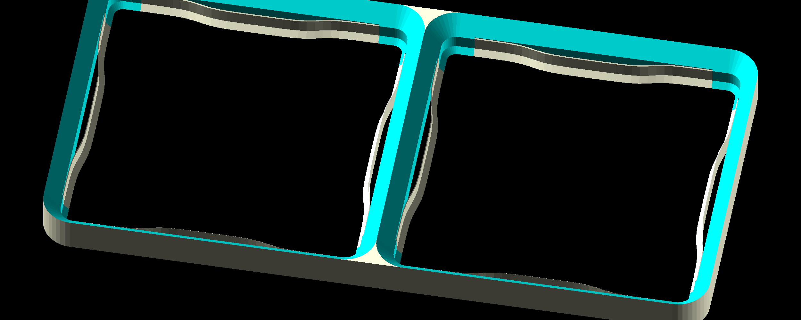

Setting the wall strength to 0 disables the backing wall entirely:

<!-- openscad -o docs/images/click1-wall-strength-0.png --camera=0,0,0,40,0,10,100 -D plate_size='[84, 42]' -D click1=true -D click1_wall_strength=0 -->
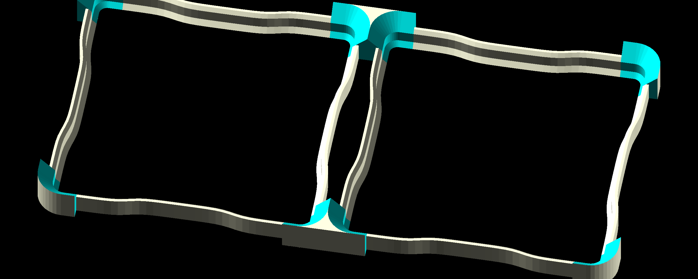

### Height

The `click1_height` property controls the height of the latch.

<!-- openscad -o docs/images/click1-height-0.5.png --camera=0,0,0,40,0,10,100 -D plate_size='[42, 42]' -D click1=true -D click1_height=0.5 -->
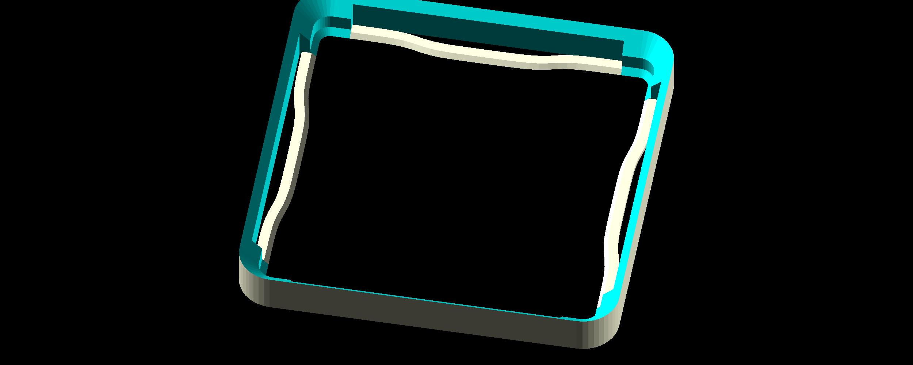

### Steepness

The arcs of the click latch follow a logistic curve, and `click1_steepness` changes the steepness of that curve. Steepness 0.1:

<!-- openscad -o docs/images/click1-steepness-0.1.png --camera=0,0,0,40,0,10,100 -D plate_size='[42, 42]' -D click1=true -D click1_steepness=0.1 -->

Steepness 5:

<!-- openscad -o docs/images/click1-steepness-5.png --camera=0,0,0,40,0,10,100 -D plate_size='[42, 42]' -D click1=true -D click1_steepness=5 -->
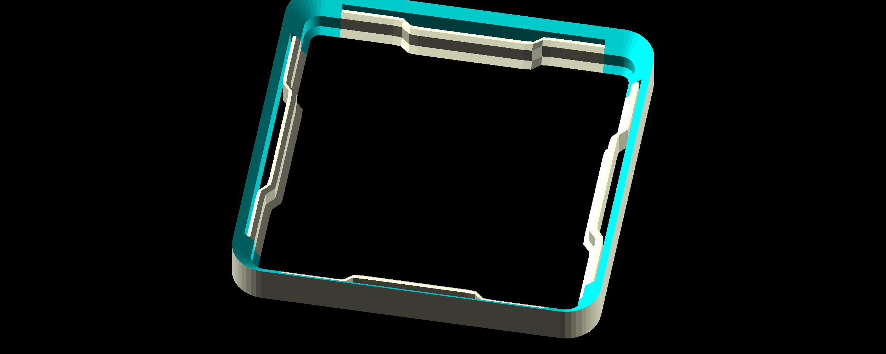

## Half-sized cells

By default, if there isn't enough room for a full cell on the plate, GridFlock will attempt to fill up remaining space with half-sized cells.

<!-- openscad -o docs/images/half.png --camera=0,0,0,40,0,10,400 -D plate_size='[147, 147]' -D magnets=false -->
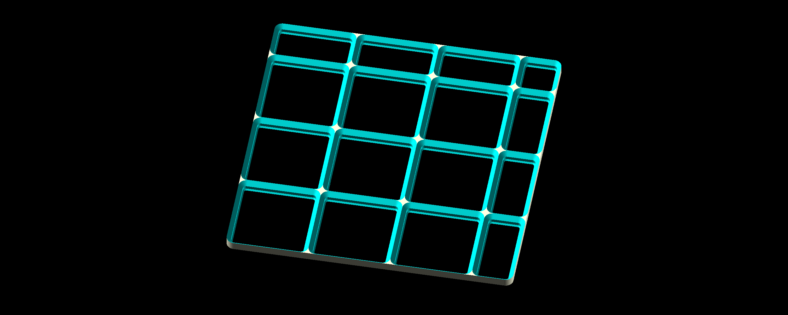

You can turn off this behavior with the `do_half_x` and `do_half_y` options.

<!-- openscad -o docs/images/halfx.png --camera=0,0,0,40,0,10,400 -D plate_size='[147, 147]' -D magnets=false -D do_half_y=false -->
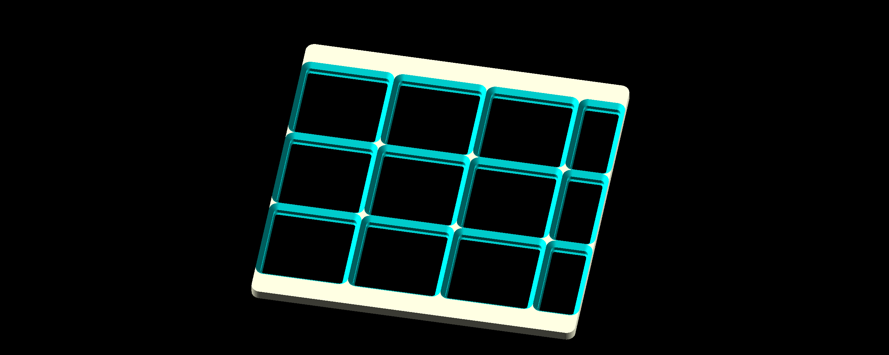

## Corner radius

GridFlock generates plates with a corner radius of 4mm by default. This matches the Gridfinity corner radius, so when the plate size is a perfect multiple of 42, there is no gap.

<!-- openscad -o docs/images/corner-radius.png --camera=0,0,0,40,0,10,100 -D plate_size='[42, 42]' -D magnets=false -->

You can configure the radius with the `plate_corner_radius` property, e.g. 1mm:

<!-- openscad -o docs/images/corner-radius-1.png --camera=0,0,0,40,0,10,100 -D plate_size='[42, 42]' -D magnets=false -D plate_corner_radius=1 -->

## Alignment

When the plate size is not a clean multiple of 42mm, the grid is centered by default. You can adjust this using the `alignment` option, which can be configured for each axis. A value of 0.5 will center the grid (the default):

<!-- openscad -o docs/images/align-center.png --camera=0,0,0,40,0,10,200 -D plate_size='[62, 62]' -D magnets=false -->

A lower value will shift the grid to the west/south direction:

<!-- openscad -o docs/images/align-west.png --camera=0,0,0,40,0,10,200 -D plate_size='[62, 62]' -D magnets=false -D alignment='[0,0.2]' -->

A higher value will shift the grid to the east/north direction:

<!-- openscad -o docs/images/align-east.png --camera=0,0,0,40,0,10,200 -D plate_size='[62, 62]' -D magnets=false -D alignment='[0.8,1]' -->

The plate size remains unchanged.

## Custom cell size

GridFlock uses Gridfinity Rebuilt under the hood. Grid dimensions are not hard-coded, so in principle it is possible to use GridFlock with a custom cell size. This is not tested and not exposed in the online generator.

<!-- openscad -o docs/images/custom-cell.png --camera=0,0,0,40,0,10,300 -D plate_size='[100, 100]' -D BASEPLATE_DIMENSIONS='[50, 33]' -D magnets=true -->
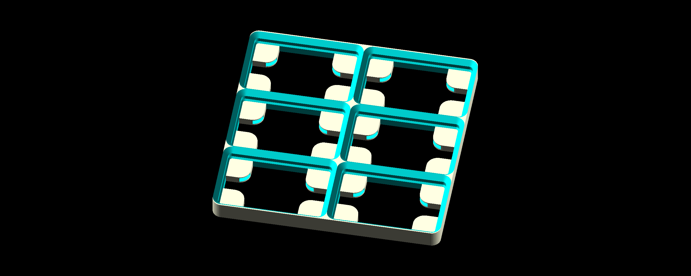

## Solid base

For added stability, you can add a solid base to the grid plate using the `solid_base` option.

<!-- openscad -o docs/images/solid_base.png --camera=0,0,0,40,0,10,200 -D plate_size='[105, 63]' -D magnets=false -D solid_base=5 -->

## Bottom Chamfer

You can add a chamfer to the edge of the plate using the `bottom_chamfer` option.

<!-- openscad -o docs/images/bottom-chamfer.png --camera=0,0,0,140,0,10,200 -D plate_size='[105, 63]' -D 'bed_size=[70, 70]' -D magnets=false -D bottom_chamfer='[1.5, 1.5, 1.5, 1.5]' -->
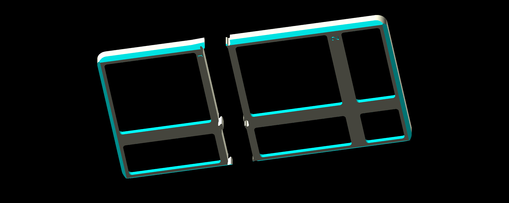

## Top Chamfer

Similarly, you can add a `top_chamfer` option.

<!-- openscad -o docs/images/top-chamfer.png --camera=0,0,0,40,0,10,200 -D plate_size='[105, 63]' -D 'bed_size=[70, 70]' -D magnets=false -D top_chamfer='[1.5, 1.5, 1.5, 1.5]' -->
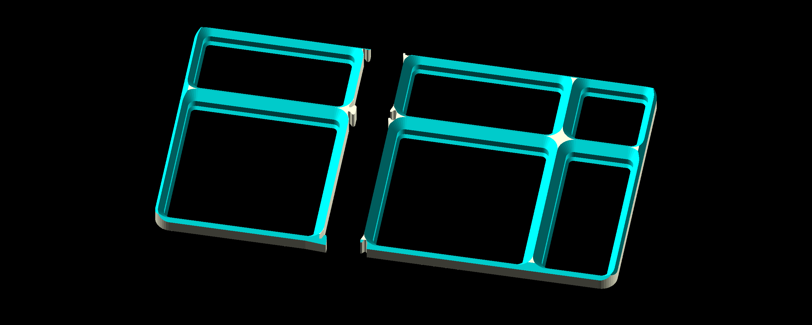

## Numbering

The number of each segment is embossed on the bottom of the segment to simplify assembly.

The depth of the embossing can be configured with `number_depth`. The size can be configured with `number_size`. The font can be configured with `number_font`.

<!-- openscad -o docs/images/numbering.png --camera=0,0,0,140,0,10,300 -D plate_size='[168, 168]' -D bed_size='[100,100]' -D magnets=false -->
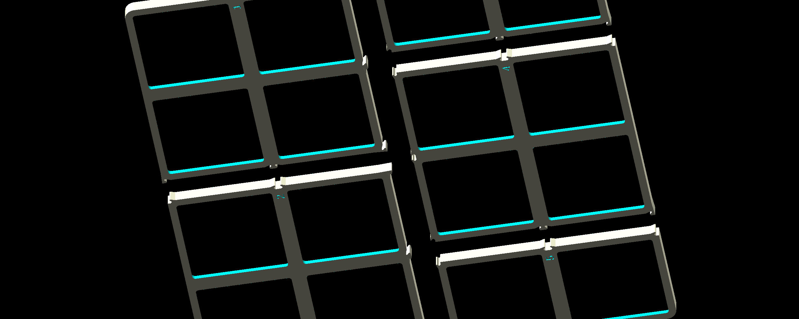

### Squeezed number

In rare cases, GridFlock may produce a segment that is only one cell wide, which leaves less room for the embossing. In that case, the smaller `number_squeeze_size` is used.

<!-- openscad -o docs/images/numbering-squeeze.png --camera=0,0,0,140,0,10,200 -D plate_size='[84, 84]' -D bed_size='[60,100]' -D magnets=false -->

## Plate Wall

The plate wall is an additional rim around the final plate. It can extend up and/or down. The thickness of the wall can be configured for each side using the `plate_wall_thickness` option. 

### Top plate wall

A top wall can be used to keep your bins from slipping off the plate.

<!-- openscad -o docs/images/wall-top.png --camera=0,0,0,40,0,20,200 -D plate_size='[84, 84]' -D magnets=false -D plate_wall_thickness='[1,1,1,1]' -D plate_wall_height='[5,0]' -->

### Bottom plate wall

A bottom wall can be used to keep your grid from slipping off e.g. a table, without requiring glue or screws to fix the grid in place.

> [!TIP]
> A bottom wall must be printed upside down. Use a brim to ensure bed adhesion. Magnets, solid base and other features may not be possible without supports.

<!-- openscad -o docs/images/wall-bottom.png --camera=0,0,0,140,0,20,200 -D plate_size='[84, 84]' -D magnets=false -D plate_wall_thickness='[1,1,1,1]' -D plate_wall_height='[0,5]' -->

## Vertical Screws

Vertical screws are inserted at cell intersections. They can be used to screw down the plate. Screws can be placed at various positions depending on use case.

<!-- openscad -o docs/images/vscrews.png --camera=0,0,0,40,0,10,400 -D plate_size='[336, 210]' -D 'bed_size=[180, 250]' -D magnets=false -D vertical_screw_plate_corners=true -D vertical_screw_segment_corners=true -D vertical_screw_other=true -->

### Screw dimensions

The screw diameter can be configured with `vertical_screw_diameter`.

<!-- openscad -o docs/images/vscrews-diameter.png --camera=0,0,0,40,0,10,200 -D plate_size='[105, 63]' -D magnets=false -D vertical_screw_other=true -D vertical_screw_segment_corners=true -D vertical_screw_plate_corners=true -D vertical_screw_diameter=2 -->

GridFlock can also make space for countersunk screws. The dimensions of the countersunk head should be specified using `vertical_screw_countersink_top`. The first value of this vector is the diameter of the head, and the second value the height of the head until the screw shaft. The below example uses `[6, 2.5]`, which are typical dimensions for an M3 countersunk screw.

<!-- openscad -o docs/images/vscrews-countersink.png --camera=0,0,0,40,0,10,200 -D plate_size='[105, 63]' -D magnets=false -D vertical_screw_other=true -D vertical_screw_segment_corners=true -D vertical_screw_plate_corners=true -D vertical_screw_countersink_top='[6, 2.5]' -->

A similar option exists for a counterbore recess.

<!-- openscad -o docs/images/vscrews-counterbore.png --camera=0,0,0,40,0,10,200 -D plate_size='[105, 63]' -D magnets=false -D vertical_screw_other=true -D vertical_screw_segment_corners=true -D vertical_screw_plate_corners=true -D vertical_screw_counterbore_top='[6, 2.5]' -->

If you combine the two options, the counterbore slot is placed above the countersink slot. You can use this to recess the countersunk head into the grid, to avoid interfering with the wider part of a bin.

<!-- openscad -o docs/images/vscrews-counterboth.png --camera=0,0,0,30,0,10,200 -D plate_size='[105, 63]' -D magnets=false -D vertical_screw_other=true -D vertical_screw_segment_corners=true -D vertical_screw_plate_corners=true -D solid_base=5 -D vertical_screw_counterbore_top='[6, 4]' -D vertical_screw_countersink_top='[6, 2.5]' -->
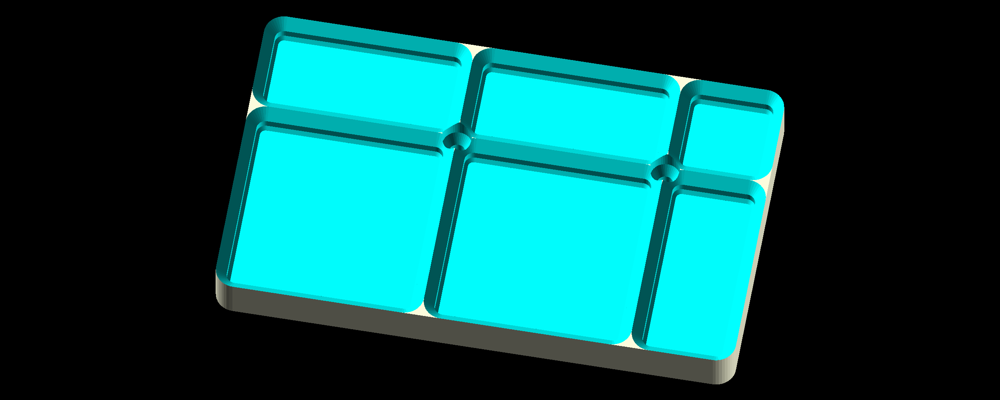

### Screw locations

During the generation process, each intersection is classified into one of five categories. Each of these categories can have screws enabled separately.

#### Plate corners

Setting `vertical_screw_plate_corners` enables screws at _plate_ corners (not _segment_!). By default, the plate corner is at the intersection that is one cell away from the plate edge.

<!-- openscad -o docs/images/vscrews-plate-corners.png --camera=0,0,0,40,0,10,400 -D plate_size='[336, 210]' -D 'bed_size=[180, 250]' -D magnets=false -D vertical_screw_plate_corners=true -->
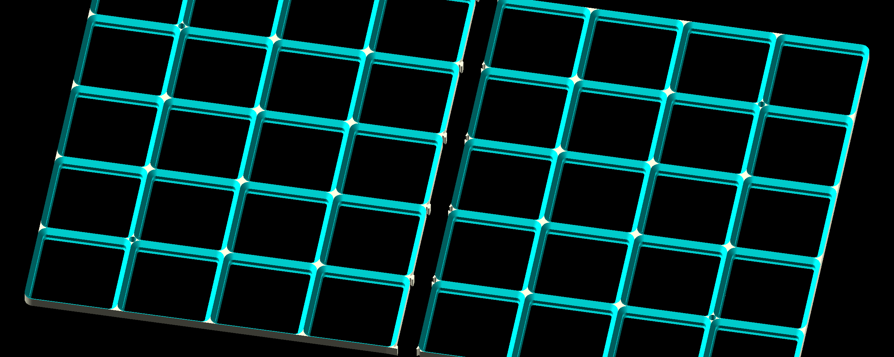

Using the `vertical_screw_plate_corner_inset` property (default 1,1), a different intersection can be selected as the plate corner. In the below example, the property has been set to `[1,2]`, which selects the second intersection in the y direction as the plate corner, instead of the first.

<!-- openscad -o docs/images/vscrews-plate-corners-mod.png --camera=0,0,0,40,0,10,400 -D plate_size='[336, 210]' -D 'bed_size=[180, 250]' -D magnets=false -D vertical_screw_plate_corners=true -D vertical_screw_plate_corner_inset='[1,2]' -->

#### Plate edges

Setting `vertical_screw_plate_edges` enables screws at _plate_ edges. These edges often don't have room for a screw, but if there's padding, it might work.

<!-- openscad -o docs/images/vscrews-plate-edges.png --camera=0,0,0,40,0,10,400 -D plate_size='[346, 220]' -D 'bed_size=[180, 250]' -D magnets=false -D vertical_screw_plate_edges=true -->
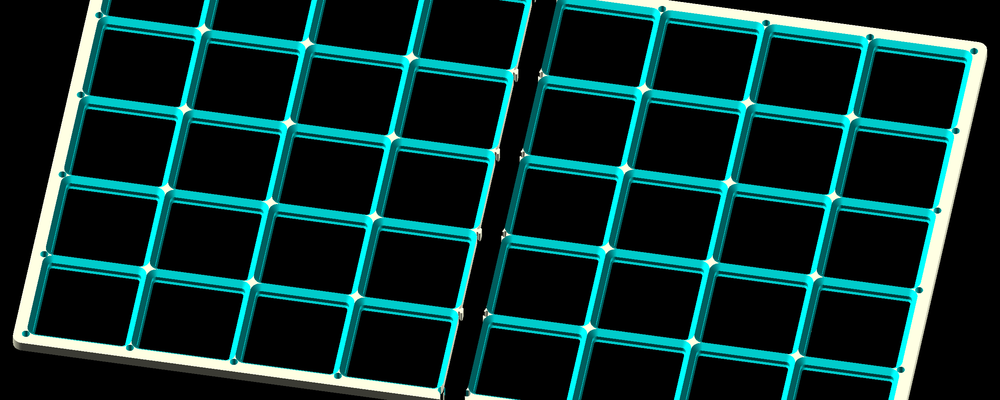

#### Segment corners

Setting `vertical_screw_segment_corners` enables screws at _segment_ corners. Similar to plate corners, the exact behavior can be configured using the `vertical_screw_segment_corner_inset` property.

> [!NOTE]
> In the below example, some of the segment corners are also plate corners. `vertical_screw_plate_corners` is disabled, so those intersections do not get a screw hole. You can enable both properties if you want screw holes in all segment corners.

<!-- openscad -o docs/images/vscrews-segment-corners.png --camera=0,0,0,40,0,10,400 -D plate_size='[336, 210]' -D 'bed_size=[180, 250]' -D magnets=false -D vertical_screw_segment_corners=true -->

#### Segment edges

Setting `vertical_screw_segment_edges` enables screws at _segment_ edges. This can interfere with the intersection puzzle connector, so this combination is not recommended.

<!-- openscad -o docs/images/vscrews-segment-edges.png --camera=0,0,0,40,0,10,400 -D plate_size='[336, 210]' -D 'bed_size=[180, 250]' -D magnets=false -D vertical_screw_segment_edges=true  -D connector_intersection_puzzle=false -D connector_edge_puzzle=true -->
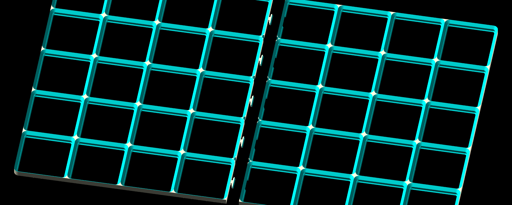

#### Other intersections

Any intersections that do not fall under the above criteria can be configured using the `vertical_screw_other` setting.

<!-- openscad -o docs/images/vscrews-else.png --camera=0,0,0,40,0,10,400 -D plate_size='[336, 210]' -D 'bed_size=[180, 250]' -D magnets=false -D vertical_screw_other=true -->

#### Combined

Vertical screw locations can be combined as needed. A common combination would be `vertical_screw_plate_corners`, `vertical_screw_segment_corners` and `vertical_screw_other`, which only leaves the segment edges without screws.

<!-- openscad -o docs/images/vscrews-most.png --camera=0,0,0,40,0,10,400 -D plate_size='[336, 210]' -D 'bed_size=[180, 250]' -D magnets=false -D vertical_screw_other=true -D vertical_screw_segment_corners=true -D vertical_screw_plate_corners=true -->

## Thumb Screw

[Gridfinity Refined](https://www.printables.com/model/413761-gridfinity-refined) has a thumb screw design to screw bins securely into base plates. GridFlock can generate a compatible thumb screw hole with the `thumbscrews` option.

<!-- openscad -o docs/images/thumb-screw-magnet.png --camera=0,0,0,40,0,10,200 -D plate_size='[105, 63]' -D magnets=true -D magnet_style=0 -D magnet_frame_style=0 -D thumbscrews=true -->
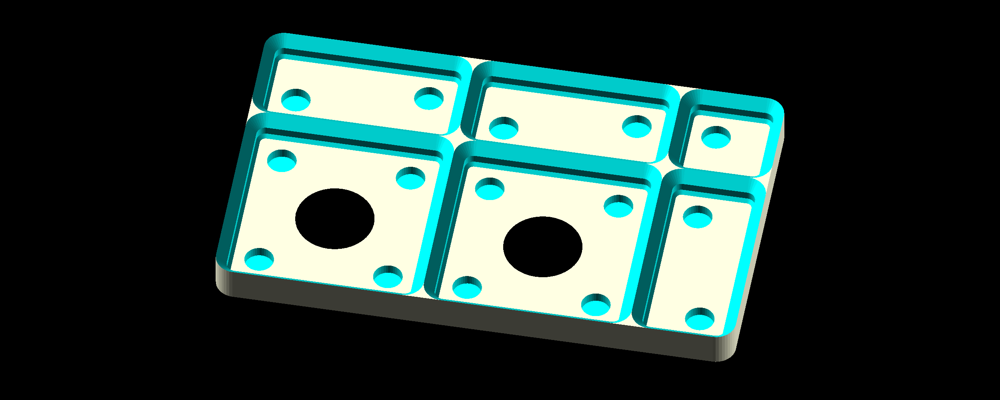

Note that in order to add a thumb screw hole, there must be something to cut the hole out of. In the above example, that is a solid frame magnet. Alternatively, you can also use a `solid_base`:

<!-- openscad -o docs/images/thumb-screw-base.png --camera=0,0,0,40,0,10,200 -D plate_size='[105, 63]' -D magnets=false -D solid_base=5 -D thumbscrews=true -->
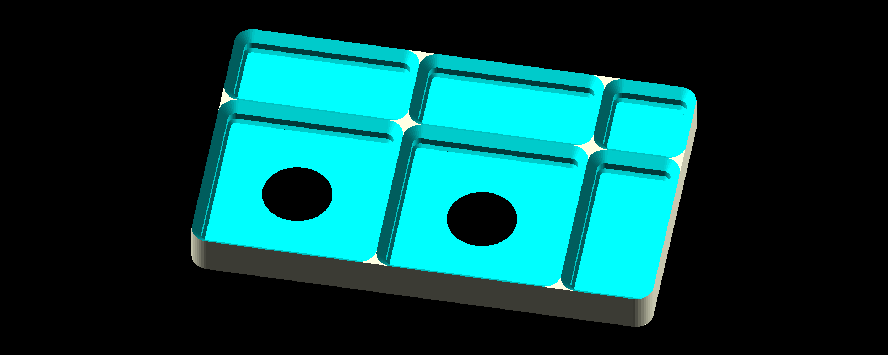

Or you can use press-fit magnets with a solid base:

<!-- openscad -o docs/images/thumb-screw-base-magnet.png --camera=0,0,0,40,0,10,200 -D plate_size='[105, 63]' -D magnets=true -D solid_base=5 -D thumbscrews=true -->
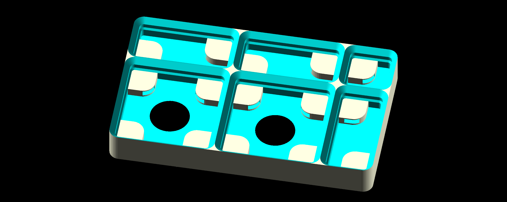

For the last option, a longer screw design is required, for example the stackable screw design from Gridfinity Refined.

## Segmentation

To produce models that fit the print bed, GridFlock splits the baseplate into _segments_. The segmentation algorithms compromise between different priorities in segment sizing.

The base plate is first split along the x axis (horizontally) and those pieces are further split along the y axis (vertically).

### Horizontal

Along the x axis, the plate is split into roughly equally sized segments by default. This is called the "ideal" algorithm.

<!-- openscad -o docs/images/segment-x-ideal.png --camera=0,0,0,40,0,10,400 -D plate_size='[252, 84]' -D bed_size='[180, 180]' -D magnets=false -D connector_intersection_puzzle=false -->
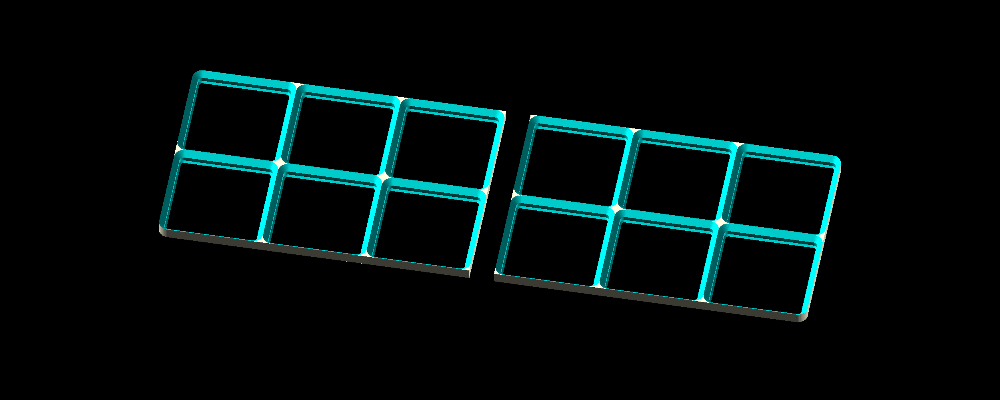

With the `x_segment_algorithm` property, you can also select the "incremental" algorithm. With this algorithm, the plate is split into pieces that are as large as possible, and the last piece is sized to use the remaining space. In this example, the printer can print four cells at a time, so the first segment is four cells wide:

<!-- openscad -o docs/images/segment-x-incremental.png --camera=0,0,0,40,0,10,400 -D plate_size='[252, 84]' -D bed_size='[180, 180]' -D magnets=false -D connector_intersection_puzzle=false -D x_segment_algorithm=1 -->
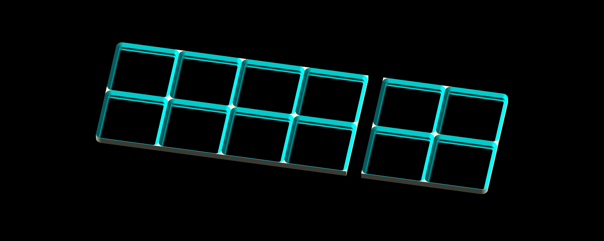

When using the incremental algorithm, you can also override the size of the first segment using the `x_column_count_first` property.

<!-- openscad -o docs/images/segment-x-incremental-override.png --camera=0,0,0,40,0,10,400 -D plate_size='[252, 84]' -D bed_size='[180, 180]' -D magnets=false -D connector_intersection_puzzle=false -D x_segment_algorithm=1 -D x_column_count_first=1 -->
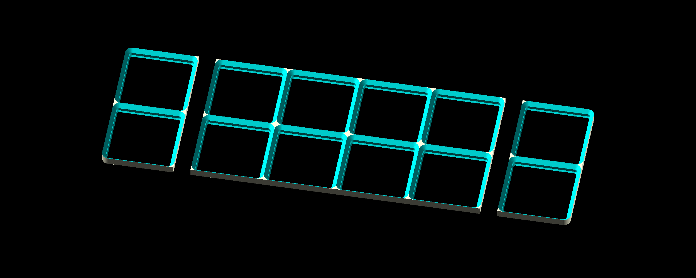

Note that the incremental algorithm has a few extra constraints, such as forbidding a last segment without cells. These constraints are satisfied by shrinking the first segment, so the first segment may not be the maximum size in all cases.

### Vertical

Vertical splitting is more complicated. The goal here is to avoid intersections where four segments meet at a corner. For this reason, there are actually two different segmentations on the y direction, which alternate. These segmentations never have a separation at the same position (they are _staggered_).

Both segmentations are planned using the incremental algorithm described above, with some adjustments to avoid single-cell segments where possible.

<!-- openscad -o docs/images/segment-y.png --camera=0,0,0,40,0,10,600 -D plate_size='[84, 252]' -D bed_size='[50, 180]' -D magnets=false -D connector_intersection_puzzle=false -->

You can override the cell count for the first segment of each plan using the `y_row_count_first` property.

<!-- openscad -o docs/images/segment-y-override.png --camera=0,0,0,40,0,10,600 -D plate_size='[84, 252]' -D bed_size='[50, 180]' -D magnets=false -D connector_intersection_puzzle=false -D y_row_count_first='[1, 1]' -->

## Edge Adjustment

The basic GridFlock cell placement algorithm is simple: Fit as many cells into the configured `plate_size`, and evenly distribute any remaining space as padding along the edges.

<!-- openscad -o docs/images/edge-adjustment-default.png --camera=0,0,0,40,0,10,400 -D plate_size='[104, 104]' -D magnets=false -->

In some cases, you may want to modify this behavior using the `edge_adjust` property. This property is added to the padding on each of the four sides _after_ the cell placement calculation.

> [!NOTE]
> Because the edge adjustment is added to the padding, it will add or remove from the final plate size!

### Shifting the grid

> [!NOTE]
> It is easier to use the alignment option for this.

You may want to move the generated grid so that it is not centered on the plate. In the below example, I've shifted the grid 5mm to the north and 10mm to the east using `edge_adjust=[-5, -10, 5, 10]` Note that the adjustment values for east and west / north and south even out so that the final plate size remains unchanged.

<!-- openscad -o docs/images/edge-adjustment-shift.png --camera=0,0,0,40,0,10,400 -D plate_size='[104, 104]' -D magnets=false -D edge_adjust='[-5, -10, 5, 10]' -->

### Adding empty space

If you do not want to generate grid cells on the full grid, you can use the edge adjustment to add padding. Below, the plate_size is `[42, 42]`, but `edge_adjust=[50, 0, 0, 0]` adds another 50mm space on the north side.

<!-- openscad -o docs/images/edge-adjustment-pad.png --camera=0,0,0,40,0,10,400 -D plate_size='[42, 42]' -D magnets=false -D edge_adjust='[50, 0, 0, 0]' -->

### Squeezing in extra cells

If your plate is slightly too large for where you want to put it, but you don't want to lose any grid cells, you can use edge adjustment to cut off a bit. In the below example, a plate size of 84x84 is combined with `edge_adjust=[0, -2, 0, -2]`, cutting off 2mm on the east and west sides. The final plate is only 80mm wide.

<!-- openscad -o docs/images/edge-adjustment-cut.png --camera=0,0,0,40,0,20,300 -D plate_size='[84, 84]' -D magnets=false -D edge_adjust='[0, -2, 0, -2]' -->

If you do this, you may of course have trouble fitting bins into the empty space.

## Cell override

For really weird use cases, you can override the content of individual cells using the `cell_override` option. Due to openscad limitations, this option is a string. Each character corresponds to a particular override style. Cells are counted from west to east and then from south to north: For a 2x2 grid, the first character customizes the lower left (SW) cell, the second character the lower right (SE) cell, the third the upper left (NW) cell, and the last character the upper right (NE) cell.

### Normal cell

A character `c` produces a normal cell. The override string is `cccc`:

<!-- openscad -o docs/images/override-normal.png --camera=0,0,0,40,0,20,300 -D plate_size='[104, 104]' -D magnets=false -D 'cell_override="cccc"' -->

### Solid

A character `s` produces a solid fill. The override string is `cssc`:

<!-- openscad -o docs/images/override-solid.png --camera=0,0,0,40,0,20,300 -D plate_size='[104, 104]' -D magnets=false -D 'cell_override="cssc"' -->

### Empty

A character `s` produces an empty cell. The override string is `ceec`:

<!-- openscad -o docs/images/override-empty.png --camera=0,0,0,40,0,20,300 -D plate_size='[104, 104]' -D magnets=false -D 'cell_override="ceec"' -->

### Irregular Shapes

The cell override feature can be used to create grids with irregular shapes. Let's say we want to create a plate with this shape:

<!-- openscad -o docs/images/irregular-base-shape.png --camera=0,0,0,40,0,20,600 -D mode=1 docs/irregular/irregular.scad -->

One way to do this is to cut a rectangular base plate with this shape, e.g. in the slicer. But if we do this with a regular base plate, we get this result:

<!-- openscad -o docs/images/irregular-no-override.png --camera=0,0,0,40,0,20,600 -D mode=2 docs/irregular/irregular.scad -->

With cell overrides, we can selectively fill some of the cells so that only the "full" cells remain.

<!-- openscad -o docs/images/irregular-override.png --camera=0,0,0,40,0,20,600 -D mode=3 docs/irregular/irregular.scad -->

## Building from source

The source file cannot be immediately opened in OpenScad. There is a dependency on Gridfinity Rebuilt, and some polygons are loaded from SVG files.

1. Install [`just`](https://just.systems/) and [`uv`](https://docs.astral.sh/uv/)
2. Clone the repository
3. Initialize the git submodules
4. Run `just paths` to extract the puzzle connector paths from the SVG
5. Now you can open `gridflock.scad` using OpenScad (development build required)

## Why the name?

Since the segments lock together, I considered "GridLock", but that's not a googleable word. I added the F from "Gridfinity" to make the name unique. You can also consider the set of segments that this project generates a "flock".
